# Sentra Assist - Architecture Visualization

## High-Level Architecture

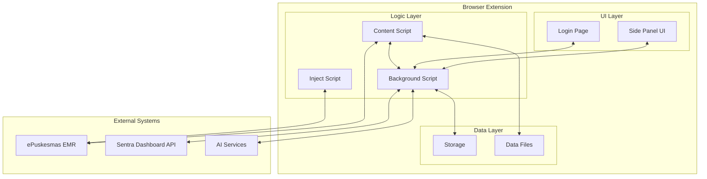

## Module Interaction Flow

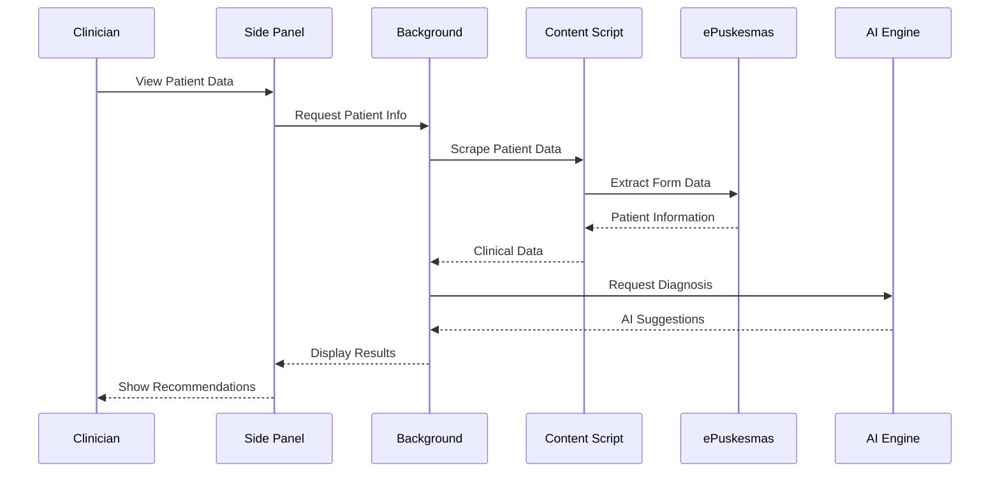

## Component Hierarchy

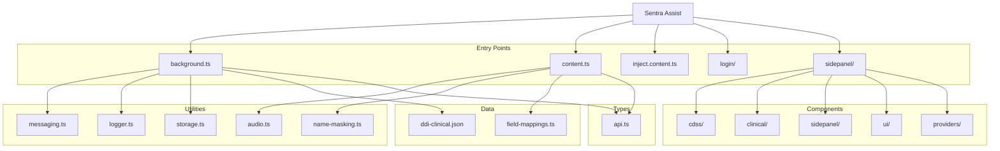

## Data Flow in Clinical Decision Support

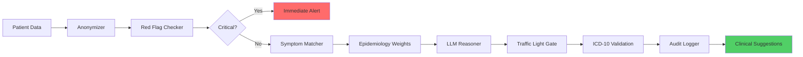

## Emergency Detection Gates

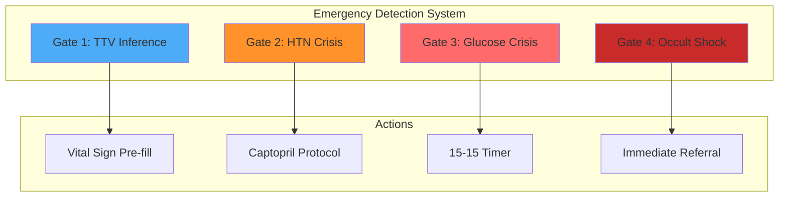

## DAS (Data Ascension System) Workflow

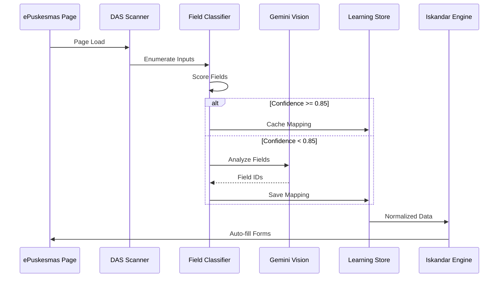

## Component Dependencies

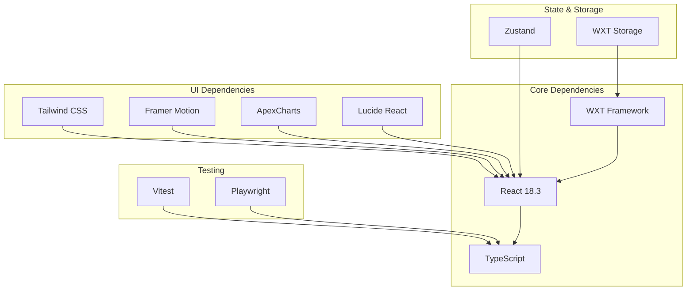

## Message Flow Between Extension Components

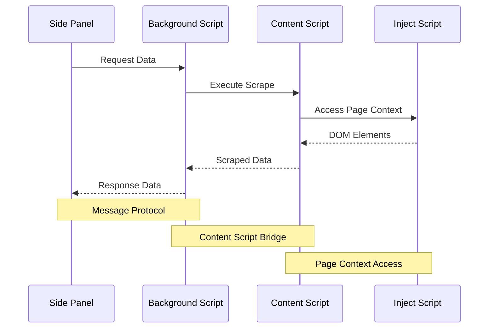

## Clinical Data Processing Pipeline

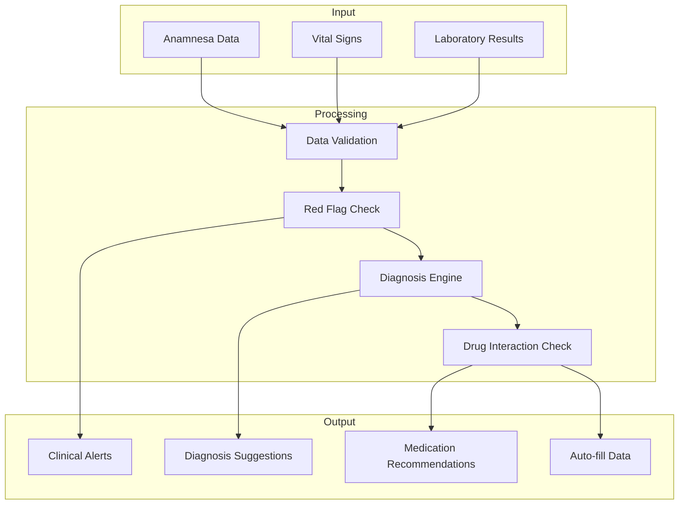

## File System Structure

```mermaid
graph TB
    Root[sentra-assist/]

    Root --> EP[entrypoints/]
    Root --> CMP[components/]
    Root --> UTIL[utils/]
    Root --> DATA[data/]
    Root --> TYPES[types/]
    Root --> DOCS[docs/]
    Root --> PUB[public/]

    EP --> BG[background.ts]
    EP --> CS[content.ts]
    EP --> IS[inject.content.ts]
    EP --> LG[login/]
    EP --> SP[sidepanel/]

    CMP --> CDSS[cdss/]
    CMP --> CLIN[clinical/]
    CMP --> SP_UI[sidepanel/]
    CMP --> UI[ui/]
    CMP --> PRV[providers/]

    UTIL --> MSG[messaging.ts]
    UTIL --> LOG[logger.ts]
    UTIL --> STR[storage.ts]

    DATA --> DDI[ddi-clinical.json]
    DATA --> FM[field-mappings.ts]

    TYPES --> API[api.ts]

    DOCS --> ADR[adr/]
    DOCS --> ARCH[architecture/]
    DOCS --> API_DOC[api/]

    PUB --> ASSETS[assets/]
    PUB --> FONTS[fonts/]
    PUB --> ICON[icon/]
```

## RME Transfer Orchestrator Flow

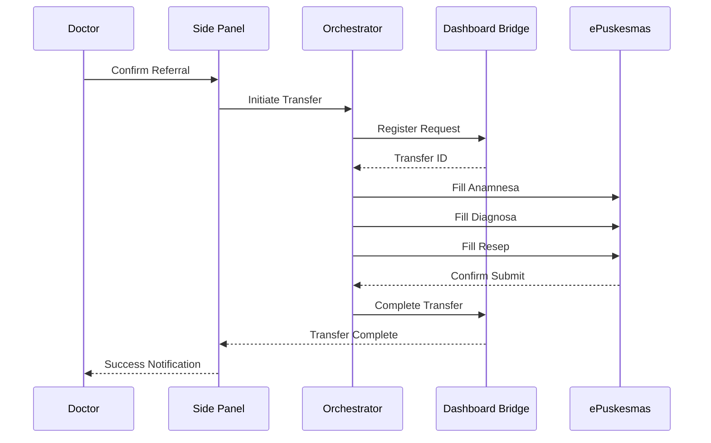
