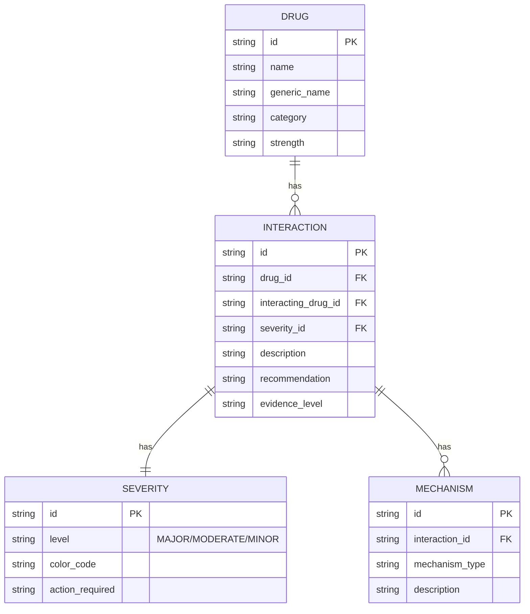
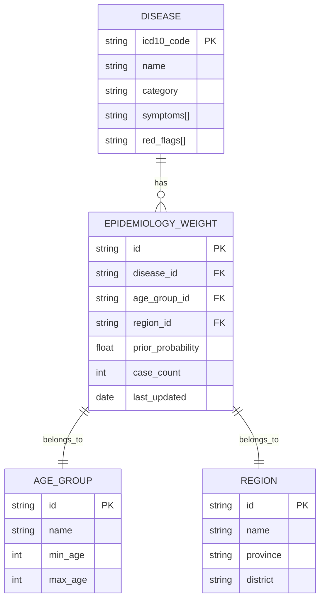
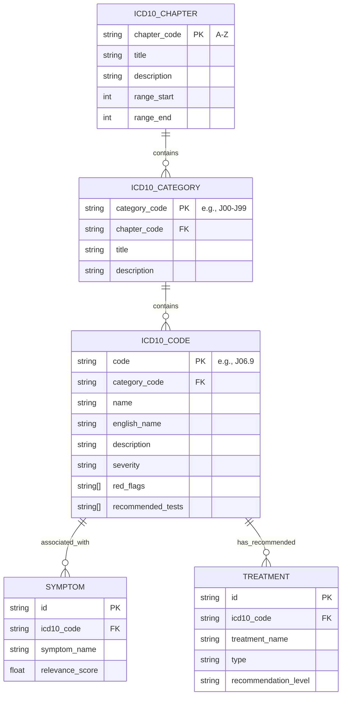
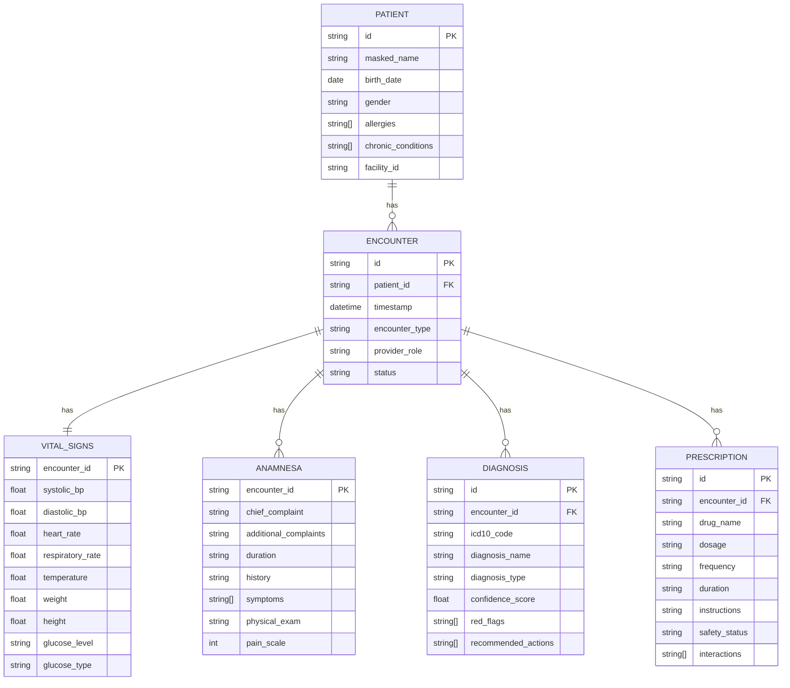
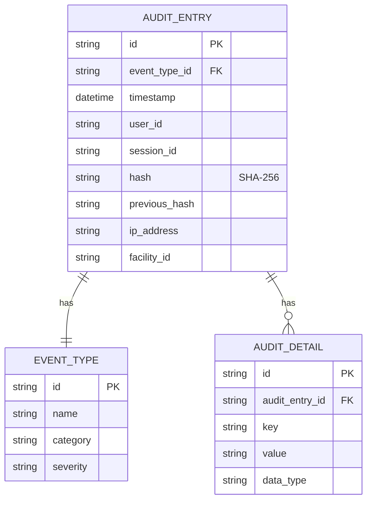
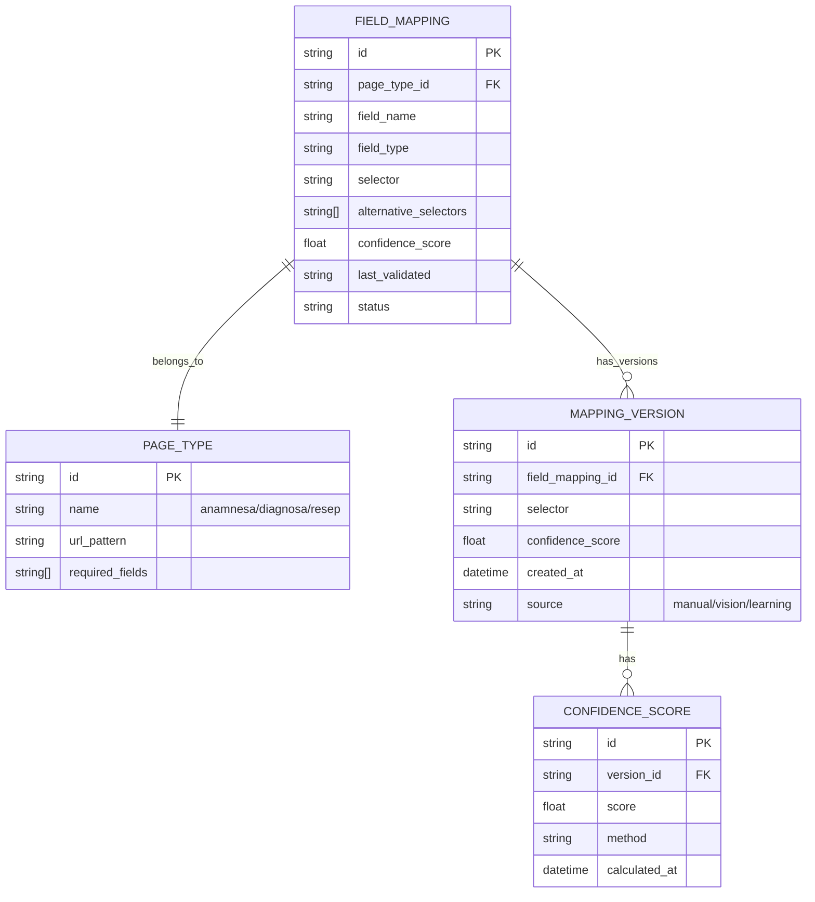
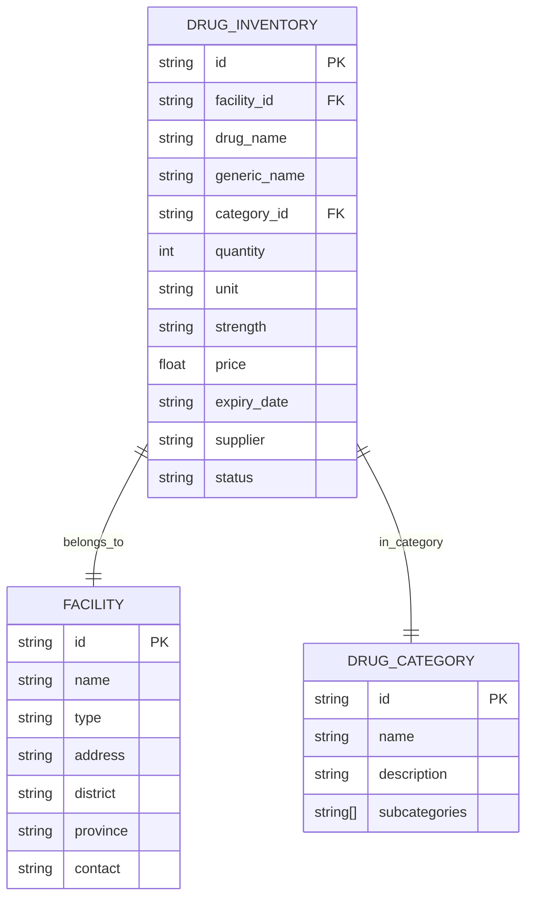
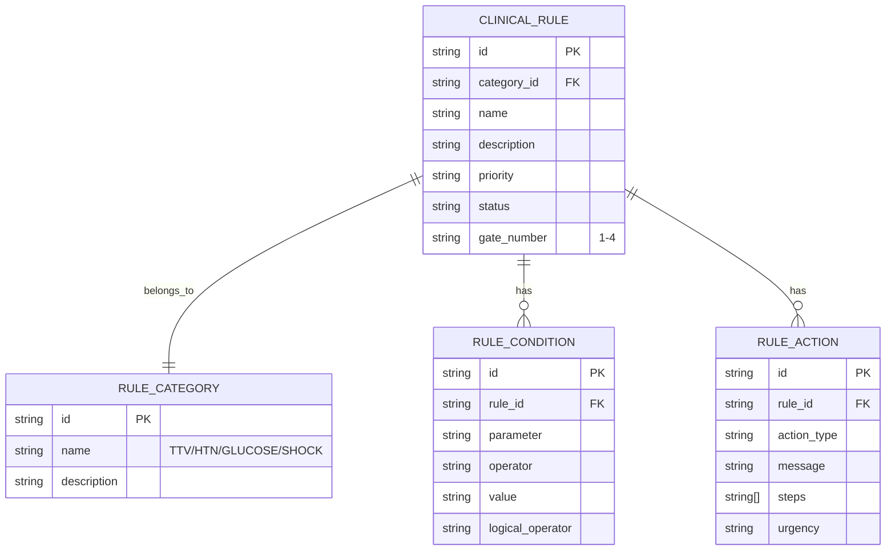
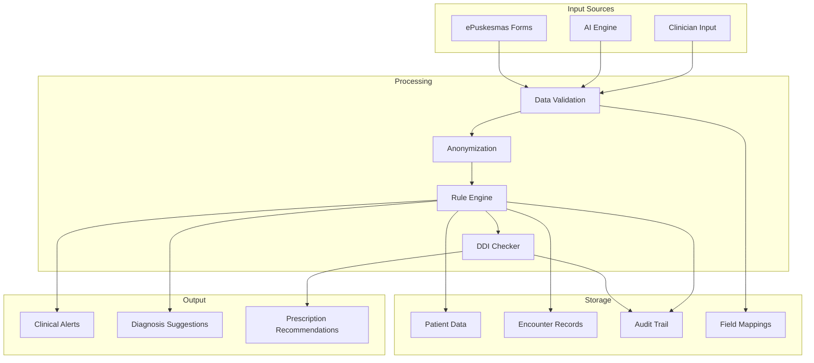

# Sentra Assist - Database Schema Visualization

## Overview
Dokumen ini menampilkan struktur database dan data yang digunakan dalam Sentra Assist.

## 1. Drug-Drug Interaction (DDI) Database

## 2. Epidemiology Weights Database

## 3. ICD-10 Database Structure

## 4. Patient Encounter Storage

## 5. Audit Trail Database

## 6. Field Mappings Storage

## 7. Drug Inventory Database

## 8. Clinical Rules Database

## Data Flow Diagram

