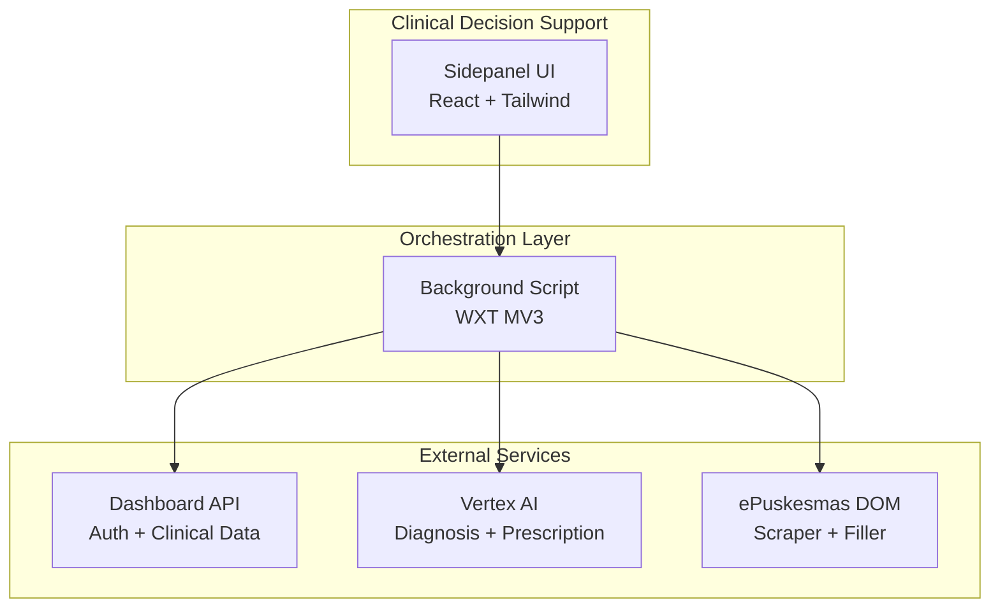

# Sentra Assist

[](https://github.com/the-abyss/sentra-assist)
[](package.json)
[](LICENSE)

**Sentra Assist** (`@the-abyss/sentra-assist`) is a premium clinical decision support (CDS) browser extension designed for Indonesian healthcare professionals using **ePuskesmas**. It acts as an AI-driven sidekick that helps identify potential diagnosis mismatches, missing clinical data, and provides smarter medication guidance to ensure patient safety.

---

## 🚀 Tech Stack

| Layer                | Technology                                            |
| -------------------- | ----------------------------------------------------- |
| **Core**             | [WXT](https://wxt.dev/) (Browser Extension Framework) |
| **Frontend**         | React 18, Tailwind CSS, Framer Motion                 |
| **Icons**            | Lucide Icons                                          |
| **AI Engine**        | Google Vertex AI (`@google-cloud/vertexai`)           |
| **State Management** | Zustand                                               |
| **Testing**          | Vitest, Testing Library, Playwright (E2E)             |
| **Runtime**          | Node.js 22+, pnpm 9+, TypeScript (Strict Mode)        |

---

## ✨ Key Features

- **Clinical Mismatch Detection**: Real-time analysis of TTV (Vital Signs) and diagnosis consistency.
- **Smart Medication Guidance**: AI-powered insights for safer drug prescriptions.
- **Dashboard Integration**: Secure synchronization with the Sentra Healthcare Dashboard.
- **Sidepanel UI**: A non-intrusive, premium dark-themed interface for clinical decision support.
- **Auth-Backed Security**: Session verification via dedicated Dashboard-backed authentication.

---

## 🛠️ Getting Started

### Prerequisites

- **Node.js**: ≥ 22.x
- **pnpm**: ≥ 9.x
- **Google Cloud Project**: Required for Vertex AI access.
- **Sentra Dashboard Account**: Required for authentication and clinical data sync.

### Installation

```powershell
# Install dependencies
pnpm install

# Copy environment template
cp .env.example .env.local
```

### Google Cloud & Vertex AI Setup

1. Create or select a Google Cloud Project.
2. Enable the **Vertex AI API** in your project.
3. Create an OAuth 2.0 Client ID for Chrome Extension (Manifest V3).
4. Add the extension ID to authorized origins.
5. Ensure your service account has `roles/aiplatform.user`.

The OAuth client ID is already configured in `wxt.config.ts`. For local development, you only need to ensure your Google account has access to the project.

### Development

```powershell
# Start WXT dev server (Chrome)
pnpm --filter @the-abyss/sentra-assist dev

# Start WXT dev server (Firefox)
pnpm --filter @the-abyss/sentra-assist dev:firefox
```

After starting the dev server:

1. Open Chrome and navigate to `chrome://extensions/`.
2. Enable **Developer mode** (toggle in top-right corner).
3. Click **Load unpacked** and select the `.output/chrome-mv3-dev` folder.
4. Pin the Sentra Assist extension to your toolbar.
5. Open an ePuskesmas page and click the extension icon to launch the sidepanel.

### Production Build

```powershell
# Build the extension for Chrome
pnpm --filter @the-abyss/sentra-assist build

# Build for Firefox
pnpm --filter @the-abyss/sentra-assist build:firefox

# Build and package as ZIP
pnpm --filter @the-abyss/sentra-assist zip
```

---

## 🔧 Environment Configuration

Copy `.env.example` to `.env.local` and configure the following variables:

| Variable                       | Description                                | Example                    |
| ------------------------------ | ------------------------------------------ | -------------------------- |
| `VITE_SENTRA_API_URL`          | Sentra Dashboard API base URL              | `https://api.sentra.local` |
| `VITE_SENTRA_API_KEY`          | API authentication key                     | `sk_dev_...`               |
| `VITE_FACILITY_ID`             | Facility identifier for multi-tenant setup | `PUSKESMAS_BALOWERTI`      |
| `VITE_USE_MOCK`                | Enable mock responses for development      | `true` / `false`           |
| `VITE_API_TIMEOUT`             | API request timeout in milliseconds        | `10000`                    |
| `VITE_DEBUG`                   | Enable debug logging                       | `true` / `false`           |
| `VITE_FEATURE_DIAGNOSIS_AI`    | Enable AI diagnosis suggestions            | `true` / `false`           |
| `VITE_FEATURE_PRESCRIPTION_AI` | Enable AI prescription recommendations     | `true` / `false`           |
| `VITE_FEATURE_DDI_CHECK`       | Enable real-time DDI checking              | `true` / `false`           |
| `VITE_FEATURE_PEDIATRIC_DOSE`  | Enable pediatric dosing calculator         | `true` / `false`           |

> **⚠️ Security Warning:** Never commit `.env.local` or any file containing credentials, API keys, or patient data.

---

## 🏛️ Architecture Overview

Sentra Assist follows a **layered architecture** with clear separation of concerns:



### Key Workflows

1. **Diagnosis Flow:** Sidepanel UI → Background Script → Dashboard API (patient data) → Vertex AI (diagnosis analysis) → Sidepanel UI (results display).
2. **Forward to Doctor:** Sidepanel UI → Background Script → Dashboard API (`/api/doctors/online`) → Dashboard API (`/api/consult`).
3. **RME Extraction:** Background Script → Content Script → ePuskesmas DOM → Background Script → Sidepanel UI.

For detailed architecture documentation, see [`docs/architecture/`](docs/architecture/).

---

## 📂 Project Structure

```text
sentra-assist/
├── .agent/                    # Operational memory (Context, Progress, Handoff)
├── entrypoints/
│   ├── sidepanel/             # Main Assist UI
│   ├── login/                 # Dashboard-backed auth UI
│   └── background.ts          # Messaging and bridge orchestration
├── components/
│   ├── clinical/              # Clinical UI (TTV, diagnosis, alerts)
│   └── sidepanel/             # Shared shell and navigation components
├── lib/
│   ├── api/                   # Auth, bridge, and fetching logic
│   └── clinical/              # AI inference and clinical rules
├── tests/                     # Vitest and Playwright test suites
├── scripts/                   # Build and utility automation scripts
└── wxt.config.ts              # Extension configuration
```

---

## 🧪 Testing Guide

### Running Tests

```powershell
# Run all unit and integration tests
pnpm --filter @the-abyss/sentra-assist test

# Run contract tests (required for all bridge interactions)
pnpm --filter @the-abyss/sentra-assist test:contract

# Run a specific test file
pnpm --filter @the-abyss/sentra-assist test -- lib/api/bridge-client.test.ts

# Run a specific test by name
pnpm --filter @the-abyss/sentra-assist test -- -t "event_id generation"

# Run E2E tests
pnpm --filter @the-abyss/sentra-assist test:e2e

# Run all quality gates
pnpm --filter @the-abyss/sentra-assist quality
```

### Writing New Tests

- Co-locate test files next to source: `*.test.ts` or `*.test.tsx`.
- Use the naming pattern: `should[ExpectedBehavior]When[StateUnderTest]`.
- Unit tests must achieve **80%+ coverage**.
- All API bridge interactions must have contract tests in `lib/api/bridge-client.test.ts`.
- E2E tests cover main user flows using Playwright.

---

## 🧪 Quality Gates

All contributions must pass the following quality gates:

```powershell
pnpm run test            # Run unit and integration tests
pnpm run test:contract   # Verify bridge client contracts
pnpm run lint            # Enforce coding standards
pnpm run typecheck       # Validate TypeScript safety
```

---

## 🐛 Troubleshooting

### Common Issues

**Issue:** Extension not loading in Chrome  
**Solution:** Ensure Developer Mode is enabled at `chrome://extensions/`, then click **Load unpacked** and select the `.output/chrome-mv3-dev` folder.

**Issue:** `pnpm install` fails or hangs  
**Solution:** Ensure you are using Node.js ≥22 and pnpm ≥9. Run `node -v` and `pnpm -v` to verify.

**Issue:** Vertex AI authentication errors  
**Solution:** Verify your Google account has access to the Cloud project and the Vertex AI API is enabled. Check the OAuth client ID in `wxt.config.ts` matches your extension ID.

**Issue:** Sidepanel shows "Login required" repeatedly  
**Solution:** Check that `VITE_SENTRA_API_URL` points to a running Dashboard API instance and your network allows the connection.

**Issue:** Build fails with TypeScript errors  
**Solution:** Run `pnpm --filter @the-abyss/sentra-assist typecheck` to see detailed errors. Ensure all dependencies are installed.

**Issue:** Changes not reflecting in the extension  
**Solution:** WXT dev server auto-rebuilds, but you must reload the extension in `chrome://extensions/` by clicking the refresh icon.

---

## 🚀 Deployment Guide

### Chrome Web Store

1. Run `pnpm --filter @the-abyss/sentra-assist build` to create a production build.
2. Run `pnpm --filter @the-abyss/sentra-assist zip` to generate a ZIP package.
3. Log in to the [Chrome Web Store Developer Dashboard](https://chrome.google.com/webstore/devconsole/).
4. Upload the ZIP file to your extension item.
5. Fill in the store listing details (description, screenshots, privacy policy).
6. Submit for review.

### Firefox Add-ons

1. Run `pnpm --filter @the-abyss/sentra-assist build:firefox`.
2. Run `pnpm --filter @the-abyss/sentra-assist zip:firefox`.
3. Log in to [Firefox Add-on Developer Hub](https://addons.mozilla.org/en-US/developers/).
4. Upload the ZIP and complete the submission form.
5. Submit for review.

---

## 🤝 Contributing

We welcome contributions! Please read our [CONTRIBUTING.md](CONTRIBUTING.md) for guidelines on:

- Code of conduct
- Development workflow
- Pull request process
- Coding standards

---

## 📚 Documentation

- [Architecture Docs](docs/architecture/) — Runtime flows, algorithm maps, and migration blueprints
- [API Documentation](API.md) — Endpoint reference and request/response examples
- [User Guide](docs/user/USER_GUIDE.md) — How to use the extension
- [Security Policy](SECURITY.md) — Security best practices and vulnerability reporting
- [Troubleshooting](README.md#-troubleshooting) — Common issues and solutions

---

## 📜 Standards & Compliance

This project adheres to the **Sentra Engineering Corps — Coding Standards v2.0**.

- **Security**: No PHI/PII or secrets in logs/commits.
- **Logic**: All Vertex AI interactions must flow through the `lib/` abstraction layer.
- **Rules**: Follow [AGENTS.md](AGENTS.md) and [.agent/](.agent/) for all operational protocols.

---

## 📄 License & Ownership

Maintained by **Chief / Sentra Artificial Intelligence**.
License: **ISC**.
Design & Masterplan by **Claudesy**.
