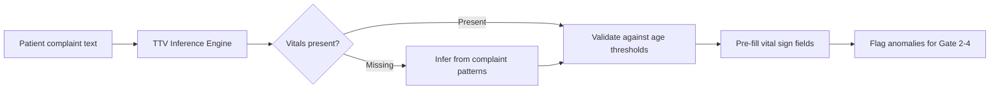
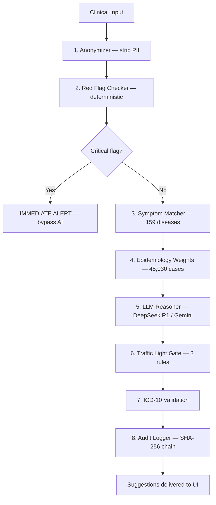
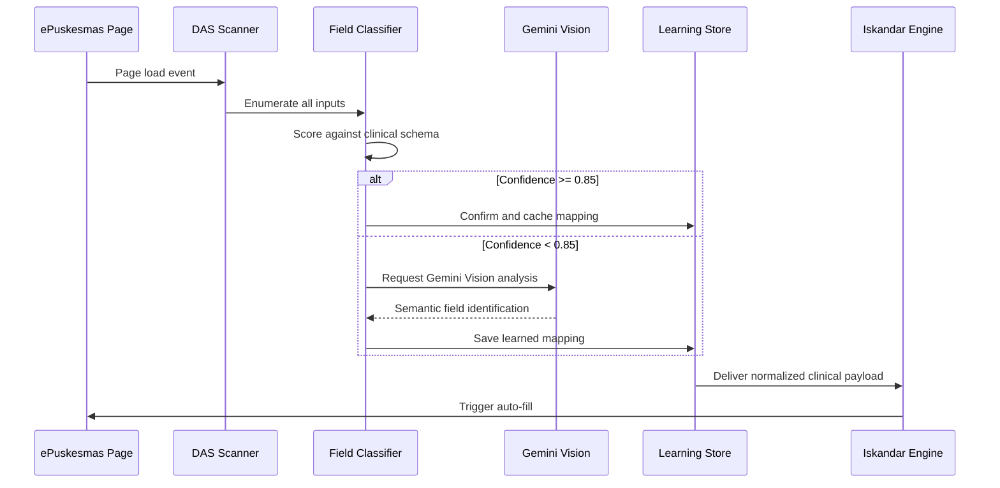
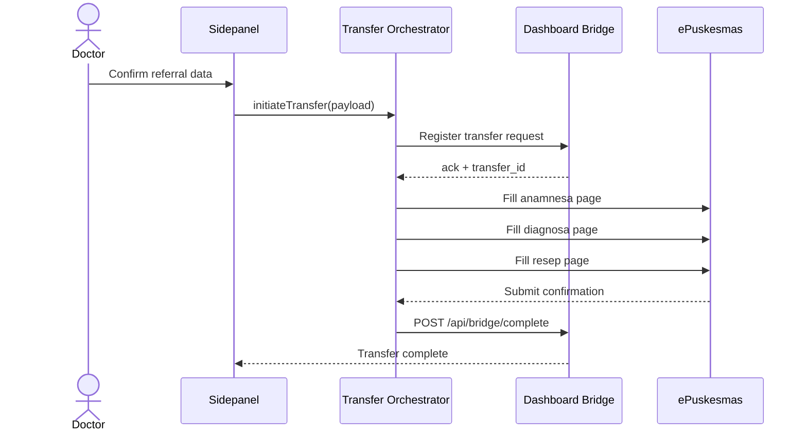

<div align="center">

# Sentra Assist

**The Intelligent Connector Between ePuskesmas and AI-Powered Clinical Decision Support**

</div>

## Overview

<table>
  <tr>
    <td width="30%" align="center" valign="middle">
      
      <br/><br/>
      <strong>SENTRA ASSIST</strong>
    </td>
    <td width="70%" valign="top">
      <p><strong>Sentra Assist</strong> is a browser extension that connects ePuskesmas patient data to the <strong>AADI (Advanced Augmentative Diagnostic Intelligence)</strong> engine — embedding real-time clinical decision support directly into the EMR workflow as an intelligent sidepanel companion. It requires no infrastructure changes at the clinic level and works within the existing ePuskesmas session.</p>
      <p>At its core, Sentra Assist is powered by the <strong>Iskandar Diagnosis Engine</strong>: an 8-step AI pipeline combining deterministic safety rules, a 159-disease knowledge base weighted by <strong>Bayesian priors from 45,030 real Indonesian clinical cases</strong>, DeepSeek R1 reasoning, and Vertex AI Gemini — all routed through a non-overridable Traffic Light safety gate before a single suggestion reaches the clinician.</p>
      <p>Patient data is surfaced from the active ePuskesmas session via <strong>DAS (Data Ascension System)</strong>, an adaptive extraction layer that auto-discovers form fields, builds confidence-scored mappings using Gemini Vision, and self-heals when ePuskesmas UI changes — eliminating brittle selector maintenance entirely.</p>
    </td>
  </tr>
</table>

<div align="center">

<sub><i>Clinical sidepanel companion — embedded decision intelligence at the point of care</i></sub>

[](package.json)
[](LICENSE)
[](https://github.com/Claudesy/sentra-assist/actions)
[](https://www.typescriptlang.org/)
[](https://wxt.dev/)
[](https://sentrahai.com)

_Designed and built by [Claudesy](https://github.com/Claudesy) (dr. Ferdi Iskandar)_

> **"Diagnosis bukan tebakan — setiap keputusan klinis harus bisa dipertanggungjawabkan."** — dr. Ferdi Iskandar, Founder

</div>

---

## Why a Locally-Calibrated Decision Support Layer

A generic CDSS treats every patient as a global baseline. Sentra Assist treats every patient as a member of a specific Indonesian primary healthcare population — with the disease priors, drug availability, and clinical context that actually exists at the puskesmas level.

| Dimension                  | Generic CDSS                   | Sentra Assist                                                               |
| -------------------------- | ------------------------------ | --------------------------------------------------------------------------- |
| **Disease priors**         | Foreign textbook static values | Bayesian weights from 45,030 real Indonesian cases                          |
| **Emergency detection**    | Single threshold rules         | 4-gate protocol: TTV inference → HTN crisis → Glucose crisis → Occult shock |
| **Drug interaction check** | Limited or cloud-only          | 173,071+ DDI entries (DDInter 2.0), runs offline                            |
| **Form automation**        | None                           | DAS adaptive extraction + full anamnesa / diagnosa / resep auto-fill        |
| **RME integration**        | Manual double-entry            | Transfer orchestrator with retry, deduplication, and session bridge         |
| **Safety architecture**    | Soft warnings                  | Non-overridable Traffic Light gate before every suggestion                  |
| **AI reasoning**           | Single model                   | DeepSeek R1 + Vertex AI Gemini with KB-only offline fallback                |

---

## Executive Summary

**Sentra Assist** is a browser extension built for Indonesian primary healthcare clinicians working inside ePuskesmas. It delivers four core capabilities in a single non-intrusive sidepanel: emergency detection, AI diagnosis support, drug safety, and documentation automation — without replacing the existing EMR workflow.

**Target Users:**

| Persona                | Role                            | Pain Point Solved                                          |
| ---------------------- | ------------------------------- | ---------------------------------------------------------- |
| General Practitioner   | Patient encounters, diagnosis   | Diagnostic uncertainty, ICD-10 coding, prescription safety |
| Nurse / Perawat        | Vital sign recording, anamnesis | Form double-entry, TTV completeness                        |
| Clinical Administrator | Referral coordination           | RME transfer errors, incomplete referral data              |

---

## Table of Contents

- [Features Overview](#features-overview)
- [Quickstart](#quickstart)
- [Detailed Features](#detailed-features)
- [Architecture](#architecture)
- [Testing and Quality Gates](#testing-and-quality-gates)
- [Deployment](#deployment)
- [Troubleshooting](#troubleshooting)
- [License](#license)

---

## Features Overview

### Emergency Detection

| #   | Feature                              | Status  | Primary User  |
| --- | ------------------------------------ | ------- | ------------- |
| 1   | TTV Inference — Gate 1               | ✅ Live | Doctor, Nurse |
| 2   | Hypertension Crisis Triage — Gate 2  | ✅ Live | Doctor        |
| 3   | Glucose Crisis Management — Gate 3   | ✅ Live | Doctor        |
| 4   | Occult Shock Detector — Gate 4       | ✅ Live | Doctor        |
| 5   | Hypoglycemia 15-15 Interactive Timer | ✅ Live | Doctor, Nurse |

### Iskandar Diagnosis Engine

| #   | Feature                                                           | Status  | Primary User |
| --- | ----------------------------------------------------------------- | ------- | ------------ |
| 6   | Red Flag Checker (sepsis, ACS, stroke, preeclampsia, anaphylaxis) | ✅ Live | Doctor       |
| 7   | Symptom Matcher — 159-disease knowledge base                      | ✅ Live | Doctor       |
| 8   | Epidemiology Weights — 45,030 Indonesian cases                    | ✅ Live | Doctor       |
| 9   | LLM Reasoner — DeepSeek R1 + Vertex AI Gemini                     | ✅ Live | Doctor       |
| 10  | Traffic Light Safety Gate                                         | ✅ Live | Doctor       |
| 11  | ICD-10 RAG Search                                                 | ✅ Live | Doctor       |
| 12  | Diagnosis Confidence Meter                                        | ✅ Live | Doctor       |
| 13  | Clinical Differential Display                                     | ✅ Live | Doctor       |

### Drug Safety

| #   | Feature                                           | Status  | Primary User |
| --- | ------------------------------------------------- | ------- | ------------ |
| 14  | DDI Checker — 173,071+ interactions (DDInter 2.0) | ✅ Live | Doctor       |
| 15  | Pharmacotherapy Reasoner                          | ✅ Live | Doctor       |
| 16  | Dosage Calculator — Pediatric + Geriatric         | ✅ Live | Doctor       |
| 17  | Prescription Form Auto-fill (ResepForm)           | ✅ Live | Doctor       |

### Clinical Analytics

| #   | Feature                                        | Status  | Primary User  |
| --- | ---------------------------------------------- | ------- | ------------- |
| 18  | Clinical Trajectory Analyzer — 5-visit trend   | ✅ Live | Doctor        |
| 19  | Mortality Proxy Scoring                        | ✅ Live | Doctor        |
| 20  | Chronic Disease Classifier — 11 categories     | ✅ Live | Doctor        |
| 21  | Vital Sign Screening Profiles (age-stratified) | ✅ Live | Doctor, Nurse |

### DAS — Form Automation

| #   | Feature                                   | Status  | Primary User  |
| --- | ----------------------------------------- | ------- | ------------- |
| 22  | DAS Scanner — adaptive field discovery    | ✅ Live | System        |
| 23  | Gemini Vision Field Classifier            | ✅ Live | System        |
| 24  | Confidence-Scored Field Mapping           | ✅ Live | System        |
| 25  | Self-Healing Remapper                     | ✅ Live | System        |
| 26  | Learning Store — per-facility persistence | ✅ Live | System        |
| 27  | Anamnesa Page Auto-fill                   | ✅ Live | Doctor, Nurse |
| 28  | Diagnosa Page Auto-fill                   | ✅ Live | Doctor        |
| 29  | Resep Page Auto-fill                      | ✅ Live | Doctor        |

### Integration & Security

| #   | Feature                                      | Status  | Primary User |
| --- | -------------------------------------------- | ------- | ------------ |
| 30  | Dashboard Bridge — real-time polling         | ✅ Live | System       |
| 31  | RME Transfer Orchestrator                    | ✅ Live | Doctor       |
| 32  | Dashboard-backed Auth (shared user accounts) | ✅ Live | All          |
| 33  | PII Anonymizer                               | ✅ Live | System       |
| 34  | Audit Trail — SHA-256 blockchain-lite chain  | ✅ Live | System       |

---

## Quickstart

### Prerequisites

| Requirement              | Version | Notes                              |
| ------------------------ | ------- | ---------------------------------- |
| Node.js                  | ≥ 22.x  | Required for WXT toolchain         |
| pnpm                     | ≥ 9.x   | Workspace package manager          |
| Google Cloud Project     | —       | Vertex AI API enabled              |
| Sentra Dashboard Account | —       | Required for auth and patient sync |

### Installation

```bash
pnpm install
cp .env.example .env.local
```

### Environment Variables

```env
VITE_SENTRA_API_URL=https://crew.puskesmasbalowerti.com
VITE_SENTRA_API_KEY=your-api-key
VITE_FACILITY_ID=PUSKESMAS_BALOWERTI
VITE_USE_MOCK=false
```

> Never commit `.env.local` or any file containing credentials, API keys, or patient data.

### Development

```bash
# Chrome (hot reload)
pnpm --filter @the-abyss/sentra-assist dev

# Firefox
pnpm --filter @the-abyss/sentra-assist dev:firefox
```

Load unpacked:

- **Chrome:** `chrome://extensions` → Enable Developer Mode → Load Unpacked → `.output/chrome-mv3-dev/`
- **Firefox:** `about:debugging` → Load Temporary Add-on → `.output/firefox-mv2-dev/manifest.json`

### Production Build

```bash
pnpm --filter @the-abyss/sentra-assist build          # Chrome MV3
pnpm --filter @the-abyss/sentra-assist zip            # Chrome Web Store ZIP
pnpm --filter @the-abyss/sentra-assist build:firefox  # Firefox MV2
```

---

## Detailed Features

### 1. TTV Inference — Gate 1

Infers unmeasured vital signs (pulse, respiratory rate, temperature ranges) from patient complaints using evidence-based pattern matching. The form is pre-filled before the doctor opens the encounter, reducing documentation time and ensuring vital sign completeness.

**Flow:**



---

### 2. Hypertension Crisis Triage — Gate 2

Classifies 8 HTN types per FKTP 2024 guidelines, detects Hypertensive Mediated Organ Damage (HMOD) red flags, and guides the Captopril SL protocol when HTN Emergency is confirmed.

**Classification Matrix:**

| Type           | Criteria                          | Action                            |
| -------------- | --------------------------------- | --------------------------------- |
| HTN Urgency    | SBP ≥180, no organ damage         | Oral antihypertensive, 1h recheck |
| HTN Emergency  | SBP ≥180 + organ damage signs     | Captopril SL, immediate referral  |
| Resistant HTN  | BP uncontrolled on 3+ drugs       | Specialist referral               |
| White-coat HTN | High in-clinic, normal ambulatory | Ambulatory monitoring             |
| Masked HTN     | Normal in-clinic, high ambulatory | 24h monitoring                    |

---

### 3. Glucose Crisis Management — Gate 3

Screens glucose values (GDS, GDP, 2JTTGO, HbA1c) against PERKENI 2024 thresholds. Identifies DKA/HHS red flags and activates the 15-15 interactive timer for active hypoglycemia management.

**API (internal):**

```typescript
glucoseClassifier.classify({
  gds: 42, // mg/dL
  symptoms: ['tremor', 'sweating', 'confusion'],
  weight: 65,
});
// → { crisis: 'HYPOGLYCEMIA', rule: '15-15', activateTimer: true }
```

---

### 4. Iskandar Diagnosis Engine — 8-Step Pipeline

The core decision support engine processes every encounter through a deterministic-first, AI-enriched pipeline. No AI output reaches the clinician without passing the Traffic Light safety gate.



---

### 5. DAS — Data Ascension System

DAS surfaces clinical data from the active ePuskesmas session into the intelligence pipeline. Instead of brittle hardcoded CSS selectors, DAS uses adaptive fingerprinting with multi-signal confidence scoring — self-healing when ePuskesmas changes its UI.



**Auto-fill coverage:**

| Page     | Fields                                                                                              |
| -------- | --------------------------------------------------------------------------------------------------- |
| Anamnesa | Keluhan utama, keluhan tambahan, duration, TTV fields, physical exam checkboxes, skala nyeri slider |
| Diagnosa | ICD-10 primary + secondary, jenis kasus, kunjungan type                                             |
| Resep    | Medication name, dosage, aturan pakai, duration, signa (with autocomplete)                          |

---

### 6. RME Transfer Orchestrator

Manages multi-step referral data transfer to ePuskesmas: anamnesa → diagnosa → resep, with per-step retry logic, deduplication, and Dashboard bridge synchronization.



---

## Architecture

### Extension Layers

```
┌─────────────────────────────────────────────────────────────┐
│                  Sidepanel UI (React + Tailwind)             │
│   Emergency Gates · Iskandar Engine · Drug Safety · DAS UI  │
└──────────────────────────┬──────────────────────────────────┘
                           │
┌──────────────────────────▼──────────────────────────────────┐
│              Background Script (WXT MV3)                     │
│       Bridge Polling · Auth Refresh · Message Routing        │
└──────────┬────────────────┬───────────────┬─────────────────┘
           │                │               │
┌──────────▼───┐  ┌─────────▼──────┐  ┌────▼────────────────┐
│  Dashboard   │  │  Vertex AI /   │  │  Content Script     │
│  API         │  │  DeepSeek R1   │  │  DAS Extraction     │
│  Auth + Sync │  │  Reasoning     │  │  Form Auto-fill     │
└──────────────┘  └────────────────┘  └─────────────────────┘
```

### Project Structure

```
sentra-assist/
├── entrypoints/
│   ├── sidepanel/             ← Main Assist UI (React)
│   ├── login/                 ← Auth entrypoint
│   └── background.ts          ← Messaging, bridge orchestration
├── components/
│   ├── clinical/              ← TTV, HTN, Glucose, Shock, Dosage, Differential, Resep
│   ├── cdss/                  ← CDSS widget, confidence meter, diagnosis cards, red flags
│   ├── sidepanel/             ← Shell, header, footer, login, credits
│   ├── providers/             ← ThemeProvider
│   └── ui/                    ← ThemeToggle, TextEffect
├── lib/
│   ├── iskandar-diagnosis-engine/ ← 8-step pipeline (31 files)
│   ├── emergency-detector/    ← 4 gates: TTV, HTN, Glucose, Shock
│   ├── api/                   ← Auth, bridge, polling, Vertex AI, DeepSeek, audit
│   ├── clinical/              ← Vital autocomplete, dosage DB, triage builder
│   ├── scraper/               ← Static field extractors
│   │   └── adaptive/          ← DAS: AI-powered adaptive detection (11 modules)
│   ├── rag/                   ← ICD-10 RAG search
│   ├── handlers/              ← Page fill handlers (anamnesa, diagnosa, resep)
│   ├── rme/                   ← Transfer orchestrator, payload + prognosis mapper
│   └── filler/                ← Form fill core (content script bridge)
├── utils/                     ← Audio, logger, messaging, name-masking, storage
├── data/                      ← DDI database (173k+ entries), field mappings
├── public/                    ← Extension assets, clinical JSON data
├── scripts/
│   ├── build/                 ← Database optimization
│   ├── data/                  ← Data conversion
│   └── dev/                   ← Dev automation, smoke tests
└── tests/                     ← Vitest setup
```

---

## Testing and Quality Gates

### Running Tests

```bash
pnpm --filter @the-abyss/sentra-assist test             # Unit + integration (264 tests)
pnpm --filter @the-abyss/sentra-assist test:contract    # Bridge API contracts
pnpm --filter @the-abyss/sentra-assist typecheck        # tsc --noEmit strict
pnpm --filter @the-abyss/sentra-assist lint             # ESLint + Prettier
```

### Required Before Merge

All four gates must pass:

```
✅ pnpm test          — 264/264
✅ pnpm test:contract — bridge contracts
✅ pnpm typecheck     — zero errors
✅ pnpm lint          — zero warnings
```

---

## Deployment

### Chrome Web Store

```bash
pnpm --filter @the-abyss/sentra-assist build
pnpm --filter @the-abyss/sentra-assist zip
# Upload ZIP to Chrome Web Store Developer Dashboard
```

### Firefox Add-ons

```bash
pnpm --filter @the-abyss/sentra-assist build:firefox
pnpm --filter @the-abyss/sentra-assist zip:firefox
# Upload to Firefox Add-on Developer Hub
```

---

## Troubleshooting

| Issue                            | Solution                                                                                      |
| -------------------------------- | --------------------------------------------------------------------------------------------- |
| Extension not loading            | Enable Developer Mode at `chrome://extensions/`, load unpacked from `.output/chrome-mv3-dev/` |
| `pnpm install` fails             | Verify Node.js ≥22 and pnpm ≥9 via `node -v` and `pnpm -v`                                    |
| Vertex AI auth errors            | Confirm Google Cloud project access and Vertex AI API is enabled                              |
| Sidepanel shows "Login required" | Check Dashboard base URL in Settings — must point to a running Sentra Dashboard instance      |
| Form not auto-filling            | DAS may need a re-scan — click **Inisialisasi** in the header status bar                      |
| Word limit error on submit       | ePuskesmas field limit is 225 words — Sentra caps keluhan automatically at 220 words          |
| TypeScript errors                | Run `pnpm typecheck` for full output                                                          |

---

## License

Sentra Assist is dual-licensed. See [LICENSE](LICENSE) for full terms.

| Use Case                                    | License                     |
| ------------------------------------------- | --------------------------- |
| Individual clinician / researcher / student | Free — Apache 2.0           |
| Puskesmas / clinic / hospital deployment    | Enterprise license required |
| Vendor / integrator / government program    | Enterprise license required |

Commercial licensing: [sentrahai.com](https://sentrahai.com)

---

## 🤖 Self-Healing CI

This project is equipped with **Auto-Fix** capabilities via `claudesy-devkit`.
If CI fails due to formatting or minor linting issues:

1. The **Auto-Fix CI** bot triggers automatically.
2. It attempts to repair the code using `pnpm format` and `pnpm lint:fix`.
3. If successful, it opens a **Pull Request** with the fixes.
4. Merge the PR to restore CI status to green.

---

<div align="center">

Designed and built by **[Claudesy](https://github.com/Claudesy)** (dr. Ferdi Iskandar)
Maintained by **Sentra Artificial Intelligence**

</div>


<!-- Test autofix: Thu Apr 16 12:50:45 SEAST 2026 -->
