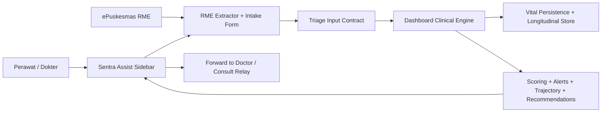
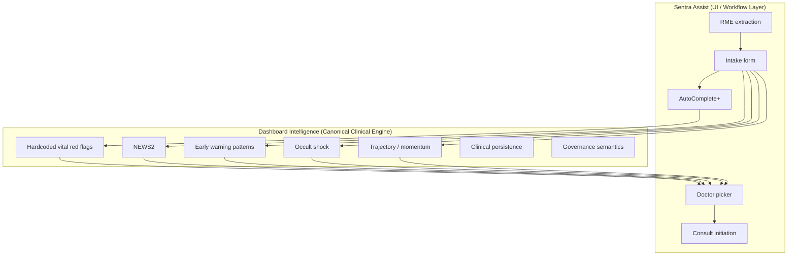
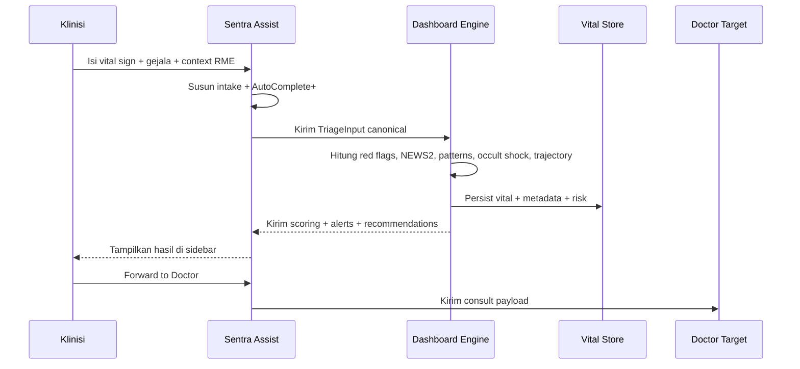

# Assist UI + Dashboard Clinical Engine Architecture

Tanggal: 2026-04-06

## Tujuan

Dokumen ini menetapkan model arsitektur target:

- `Assist` menjadi surface utama untuk klinisi
- `Dashboard Intelligence` menjadi canonical clinical engine

Dengan model ini, klinisi tetap bekerja di sidebar / widget yang mereka sukai, tetapi perhitungan klinis inti tidak diduplikasi.

## Prinsip Inti

- `Assist` = workflow-first UI
- `Dashboard` = source of truth untuk clinical scoring
- tidak ada engine klinis paralel yang hidup sendiri di extension

## Diagram Konteks

## Diagram Boundary

## Runtime Flow

## Apa Yang Hidup Di Assist

`Assist` tetap memiliki:

- extractor RME / ePuskesmas
- intake form bedside
- `AutoComplete+`
- summary pasien
- consult snapshot
- doctor ranking UI
- `Forward to Doctor`

`Assist` tidak menjadi owner utama untuk:

- NEWS2
- red flag semantics final
- occult shock final
- trajectory risk semantics
- longitudinal persistence

## Apa Yang Hidup Di Dashboard Engine

`Dashboard` menjadi owner utama untuk:

- hardcoded vital red flags canonical
- NEWS2 canonical
- disease-specific early warning patterns
- occult shock canonical
- trajectory / momentum canonical
- vital persistence longitudinal
- alert severity semantics dan governance

## Triage Input Contract

Input minimum yang sebaiknya dikirim dari `Assist` ke engine canonical:

- patient context minimal
  - gender
  - age
  - RM / patient identifier aman
- vital signs
  - SBP
  - DBP
  - HR
  - RR
  - Temp
  - SpO2
  - Glucose
- narrative
  - `keluhan_utama`
  - `keluhan_tambahan`
- context tambahan
  - chronic diseases
  - allergies
  - pregnancy status
  - structured bedside signs
  - extracted special conditions

## Output Contract

Output minimum yang dikirim balik dari engine canonical ke `Assist`:

- red flags
- NEWS2 score + risk level
- early warning matches
- occult shock result
- trajectory summary jika tersedia
- recommended actions
- governance disclaimer

## Keuntungan Model Ini

- klinisi tetap bekerja di flow yang mereka sukai
- logic klinis final tidak duplicated
- auditability lebih kuat
- perubahan threshold cukup di satu tempat
- drift antar app turun drastis

## Yang Harus Dihindari

- copy-paste seluruh engine dashboard ke extension
- membiarkan `Assist` punya threshold klinis versi sendiri tanpa sinkronisasi
- menempatkan governance semantics di dua tempat berbeda

## Kalimat Keputusan Produk

Kalimat yang aman dipakai:

- `Assist adalah cockpit klinisi.`
- `Dashboard intelligence adalah mesin klinis kanonik.`
- `Assist menampilkan dan mengirim, dashboard menghitung dan memutuskan semantics klinis.`

## Related Files

- `docs/architecture/vital-sign-engine-comparison-matrix.md`
- `docs/architecture/vital-sign-algorithm-map.md`
- `docs/architecture/vital-sign-executive-brief.md`
