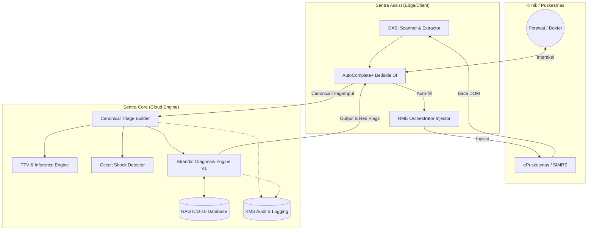

# CETAK BIRU ARSITEKTUR & SPESIFIKASI KLINIS: SENTRA ASSIST

**Dokumen Kontrol:**

- **Versi:** 2.0 (Arsitektur Enterprise & Rekayasa Klinis)
- **Tanggal Rilis:** 7 April 2026
- **Status:** Final & Berlaku (Active)
- **Klasifikasi:** Rahasia Perusahaan (Internal Sentra Healthcare AI)
- **Kepatuhan:** Permenkes No.24/2022 (RME), UU PDP, SATUSEHAT Interoperability

---

## DAFTAR ISI

1. [Pendahuluan & Konsep Arsitektur](#1-pendahuluan--konsep-arsitektur)
2. [Ekosistem Triase: Data Acquisition & Inference](#2-ekosistem-triase-data-acquisition--inference)
3. [Algoritme Kegawatdaruratan: Occult Shock & TTV](#3-algoritme-kegawatdaruratan-occult-shock--ttv)
4. [Iskandar Diagnosis Engine (IDE-V1) & RAG ICD-10](#4-iskandar-diagnosis-engine-ide-v1--rag-icd-10)
5. [Orkestrasi Transfer RME (RME Orchestrator)](#5-orkestrasi-transfer-rme-rme-orchestrator)
6. [Sistem Tata Kelola Medis & Auditabilitas](#6-sistem-tata-kelola-medis--auditabilitas)

---

## 1. PENDAHULUAN & KONSEP ARSITEKTUR

**Sentra Assist** diciptakan untuk menyelesaikan kesenjangan kualitas antara fasilitas medis primer (Puskesmas/Klinik) dengan standar diagnosis spesialis. Aplikasi ini beroperasi pada topologi arsitektur **Assist-First UI, Dashboard-First Engine**.

Dalam ekosistem ini, klien antarmuka (ekstensi WXT) bertugas eksklusif pada pemanenan data organik (_Data Acquisition System_) dan injeksi DOM (_Document Object Model_), sementara komputasi klinis berat yang mensyaratkan standar keselamatan pasien yang ketat dijalankan tersentralisasi di **Canonical Dashboard Engine**. Model ini memastikan tidak ada duplikasi kalkulasi ambang batas medis _(No Threshold Fragmentation)_.

---

## 2. EKOSISTEM TRIASE: DATA ACQUISITION & INFERENCE

### 2.1 Data Acquisition System (DAS)

Modul DAS beroperasi tanpa menghentikan alur kerja pengguna (Zero-Click Extraction). Sistem memindai `DOM` RME yang sedang aktif untuk menangkap empat klaster data utama:

1. **Patient Identity:** RM, Nama, Usia, Gender, BPJS.
2. **Clinical Context:** Kondisi Khusus, Alergi, Risiko Kehamilan (Wajib bagi profil wanita).
3. **Chronic History:** Riwayat DM, Hipertensi, Jantung, Asma (dengan prioritas pembacaan teks langsung atau pemetaan _dropdown_).
4. **Visit History:** Mengambil minimum 3 kunjungan longitudinal terakhir pasien.

**Keamanan Privasi (UU PDP):**
DAS beroperasi murni pada memori lokal _browser_ (RAM). Sistem mengekstrak PII _(Personally Identifiable Information)_ secara _volatile_, dan sebelum dikirimkan ke _Core Engine_, PII mengalami pencabutan _(anonymization)_.

### 2.2 TTV Inference Algorithm (Sintesis Tanda Vital)

Sistem sering mendapati nakes tidak sempat memasukkan Tanda-Tanda Vital (TTV) secara lengkap di lapangan darurat. Algoritme `inferVitals()` menyintesis proyeksi TTV yang logis secara biologis berdasarkan keluhan pasien (_Symptom Pattern Matching_).

- **Metode:** Parsing kata kunci gejala dengan _uniform distribution array_ berdasarkan pedoman WHO/AHA.
- **Contoh Matematis:** Jika keluhan memuat "demam" (Fever Infection Pattern), suhu diestimasi 38.0–39.5°C, dan sistem menghitung kompensasi takikardia (Nadi dinaikkan menjadi 90–110 bpm mengacu pada hukum klinis: laju jantung naik ~10 bpm setiap kenaikan 1°C).
- **Akuntabilitas:** Semua nilai inferensi secara transparan diberi label metada khusus `source: 'inferred'` dan `confidence_level`.

---

## 3. ALGORITME KEGAWATDARURATAN: OCCULT SHOCK & TTV

### 3.1 Occult Shock Detector (Deteksi Syok Terselubung)

Hipertensi kronis kerap menyamarkan fase awal syok absolut. Seseorang dengan baseline tensi 180/100 yang mendadak turun menjadi 110/70 mungkin terlihat normal secara statistik umum, namun sesungguhnya sedang mengalami hipoperfusi berat.

Sentra Assist menerapkan **MSF Shock Guidelines** secara otomatis:

1. **Sanitasi Hipoglikemik:** Mesin mengecek gula darah $\le$ 70 mg/dL lebih awal (karena mensimulasikan gejala syok).
2. **Baseline Extraction:** Memilah median tekanan darah _(Robust Outlier Rejection)_ dari minimal 3 riwayat rekam medis terakhir pasien.
3. **Kalkulasi Mean Arterial Pressure (MAP):** `MAP = DBP + 1/3(SBP - DBP)`.
4. **Validasi Syok Relatif:** Sistem memantik bendera `CRITICAL` bila:
   - Terdapat **Absolute Hypotension**: SBP < 90 atau MAP < 65.
   - Atau **Relative Hypotension**: $\Delta$SBP dari baseline $\ge$ 40 mmHg disertai gejala akut neurologis (pusing/sinkop/lemas).

Algoritme ini menyelamatkan nyawa dengan mengarahkan staf medis ke pemeriksaan CRT (_Capillary Refill Time_), _fluid challenge_, dan menunda antihipertensi.

---

## 4. ISKANDAR DIAGNOSIS ENGINE (IDE-V1) & RAG ICD-10

IDE-V1 merupakan otak dari sistem pengambilan keputusan medis CDSS _(Clinical Decision Support System)_.

### 4.1 Arsitektur 8 Lapis (IDE-V1 8-Step Pipeline)

Proses komputasi diagnosis bukan pemanggilan LLM biasa, melainkan melalui 8 bendungan protektif:

1. **Anonymizer:** Pembersihan mutlak PII. Batal otomatis (_throw error_) jika verifikasi bocor.
2. **Red Flag Checks:** Analisis _hardcoded_ (statis) tanpa dependensi API eksternal untuk mengenali kondisi kegawatdaruratan di detik pertama.
3. **Symptom Matcher (Local KB):** Perhitungan deterministik deterministik <100ms menggunakan persamaan _Inverse Document Frequency_ (IDF) + _Jaccard Similarity_ terhadap 159 penyakit klinis.
4. **Epidemiology Weights:** Modifikasi probabilitas temuan berdasarkan prevalensi lokal yang disintesis dari 45.030 sampel kunjungan puskesmas (Prior Bayes).
5. **LLM Reasoner:** Lapisan sintesis dan pengkayaan medis.
6. **Traffic Light Gate:** 8-aturan _hard-gate_ keselamatan berbasis modifikator usia dan komorbid pasien.
7. **ICD-10 Validation (RAG Layer):** Validasi kesesuaian diagnosis dengan _database_ BPJS.
8. **Audit Logging:** Mengunci keputusan klinis, _latency_, dan skor keyakinan (_confidence level_) dalam log yang tidak dapat diubah _(append-only)_.

### 4.2 RAG ICD-10 Search Engine

Sistem pencarian ICD-10 terpadu menggunakan 5 lapis strategi:

- Kode Tepat (Exact Code).
- Awalan Kode (Code Prefix Category).
- Ekspansi Simtomatik (_Symptom keyword expansion_).
- Indeks Kata Kunci Langsung.
- Pencarian _Fuzzy Description_.
  Sistem memberikan pendorong nilai (`boostCommonScore` +0.15) bagi penyakit komunal yang paling sering ditemui di Puskesmas, memberikan presisi tajam bagi operasional sehari-hari BPJS.

---

## 5. ORKESTRASI TRANSFER RME (RME ORCHESTRATOR)

Injeksi data kembali ke sistem RME pemerintah diatasi dengan **RME Transfer Orchestrator** yang amat mumpuni (Resilient I/O).

### 5.1 Idempotensi & Sidik Jari (Fingerprint Deduplication)

Masalah _double-click_ atau asinkronisasi koneksi di daerah terpencil diselesaikan lewat metode _hashing_. Parameter transfer di-_hash_ menjadi identitas sidik jari statik (`hashString` FNV-1a). Selama 7.000 milidetik _(Dedupe Window)_, perintah kembar dari klien secara cerdas dibatalkan (`DUPLICATE_SUPPRESSED`).

### 5.2 Manajemen Eksekusi Tangguh

- **Prioritisation Chain:** Dieksekusi berurutan: `anamnesa` $\to$ `diagnosa` $\to$ `resep`.
- **Intelligent Backoff Retry:** Gagalnya elemen DOM dimitigasi dengan `wait(retryDelayMs * attempt)`.
- **Lexical Failure Classification:** Jika DOM gagal membaca `readonly` atau `protected`, sistem akan mengklasifikasikannya sebagai lewatan yang sah (`skipped` alih-alih `failed`), sehingga alur pengisian bagian rekam medis lain tidak berhenti (mencegah distorsi antarmuka nakes).

---

## 6. SISTEM TATA KELOLA MEDIS & AUDITABILITAS

Sebagai prasyarat bagi faskes pemerintah dan regulasi Menteri Kesehatan, Sentra Assist dirancang dengan kepatuhan **Clinical Governance**:

1. **Audit-Trail Terenkripsi:** Tiap siklus IDE-V1 men-_generate_ `session_id` terikat yang mencatat jumlah bendera merah (_red flags_), diagnosis AI (lengkap dengan _confidence score_), hingga keabsahan validasi _fallback_. Memudahkan proses penyelidikan insiden (_root cause analysis_).
2. **Kemandirian Klinisi (Human-in-the-Loop):** Keseluruhan arsitektur didesain sebagai _Decision Support_, bukan sistem kemudi otonom. Mandatori pada setiap lembar akhir _output_ Sentra Assist menyertakan _Disclaimer_ statis:
   > _"Ini adalah alat bantu keputusan klinis. Keputusan akhir ada pada dokter."_
3. **Transparansi Intervensi (Seamless Handoff):** Untuk merujuk kepada spesialis (Via _Bridge Forward-to-Doctor_), data dienkapsulasi menjadi _Consult Payload_ utuh. Menghilangkan insiden distorsi rekam medis karena penulisan tangan manual yang salah.

---

_(Dokumen selesai — Resmi diterbitkan oleh Divisi Engineering Sentra Healthcare AI)_
