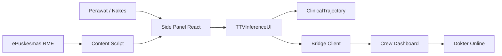
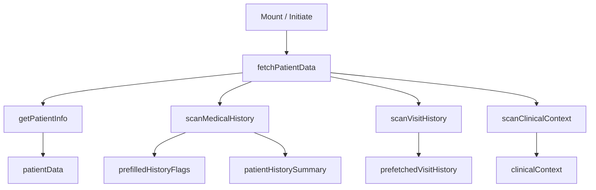
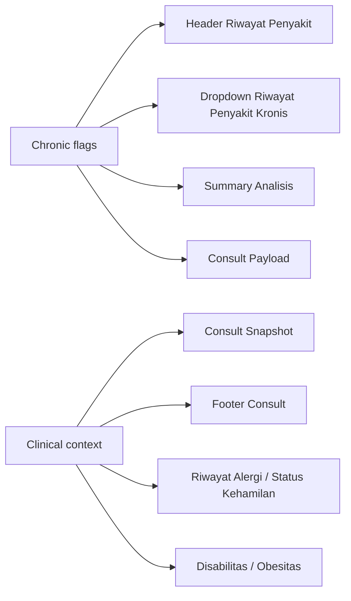
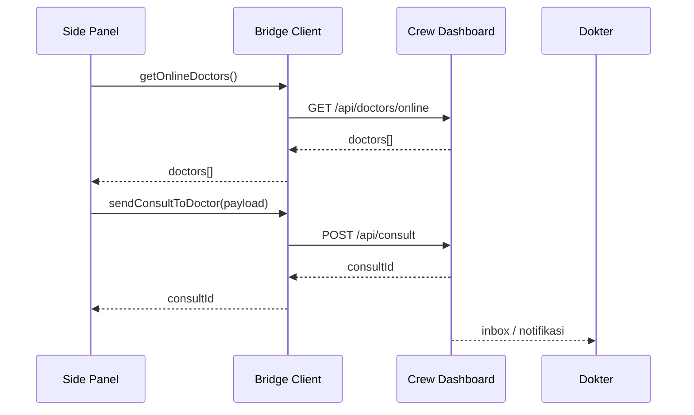

# Sentra Assist Runtime Architecture

Tanggal: 2026-04-06

## Scope

Dokumen ini menjelaskan mekanisme runtime Sentra Assist yang aktif saat ini pada side panel ePuskesmas.

## Context

## Runtime Boot Sequence

## Data Surfaces

### 1. Patient Identity

Sumber: `getPatientInfo`

Output:

- `name`
- `gender`
- `age`
- `rm`
- `dob`
- `bpjsStatus`
- `kelurahan`

### 2. Chronic History

Sumber: `scanMedicalHistory`

Strategi:

- prioritas `Penyakit Kronis` direct field
- fallback tabel / ICD / text scan

Mapping internal:

- `dm`
- `ht`
- `jantung`
- `stroke`
- `ginjal`
- `asma`

### 3. Clinical Context

Sumber: `scanClinicalContext`

Field aktif:

- `facilityName`
- `payerLabel`
- `specialConditions`
- `pregnancyRisk`
- `allergies`
- `pregnancyStatus`

### 4. Visit History

Sumber: `scanVisitHistory`

Aturan:

- target 5 kunjungan
- minimum usable 3
- `< 3` => `insufficient`

## UI Synchronization

## AutoComplete+

Input utama:

- vital signs
- gejala / keluhan
- riwayat penyakit kronis efektif
- alergi
- status kehamilan
- preset
- disabilitas
- obesitas

Output:

- `alerts`
- draft anamnesa deterministik yang langsung mengisi kolom gejala
- summary analisis
- `TTVInferenceData`

Aturan penting:

- input 3-4 gejala tidak dihalusinasi menjadi fakta baru
- detail yang tidak ditulis user tidak diisi secara spekulatif
- hasil draft tetap editable oleh nakes di kolom gejala yang sama

## Intake UI Rules

- row intake padat setelah kolom gejala:
  - `Riwayat Alergi | Status Kehamilan`
  - `Disabilitas | Obesitas`
- `Status Kehamilan`
  - pasien perempuan: wajib diisi, diberi cue pink halus saat kosong
  - pasien laki-laki: field statis `Tidak relevan`
- dropdown standard custom dipakai untuk:
  - `Riwayat Alergi`
  - `Disabilitas`
  - `Obesitas`
  - `AutoComplete+ Preset`

## Forward to Doctor

## Doctor Ranking Logic

Urutan prioritas:

1. `availability_status`
2. kecocokan `poli`
3. kecocokan `facility_name/location_name`
4. nama dokter

UI transparansi:

- `matched poli`
- `same facility`

## Fallback Rules

- nama pasien invalid => `---`
- chronic history kosong => `Menunggu Input`
- payer kosong => fallback ke `bpjsStatus`
- `Penyakit Khusus` kosong => `Tidak terdeteksi`
- `Risiko Kehamilan` kosong => `Tidak terdeteksi`
- histori `< 3` => `Data not available` pada jalur trajectory
- `Status Kehamilan` pasien laki-laki => `Tidak relevan`
- `Obesitas` memakai wording `Terkonfirmasi` / `Tidak Terkonfirmasi`

## Related Files

- `entrypoints/content.ts`
- `entrypoints/sidepanel/main.tsx`
- `components/clinical/TTVInferenceUI.tsx`
- `lib/api/bridge-client.ts`
- `docs/forward-to-doctor-integration.md`
- `docs/architecture/vital-sign-algorithm-map.md`
