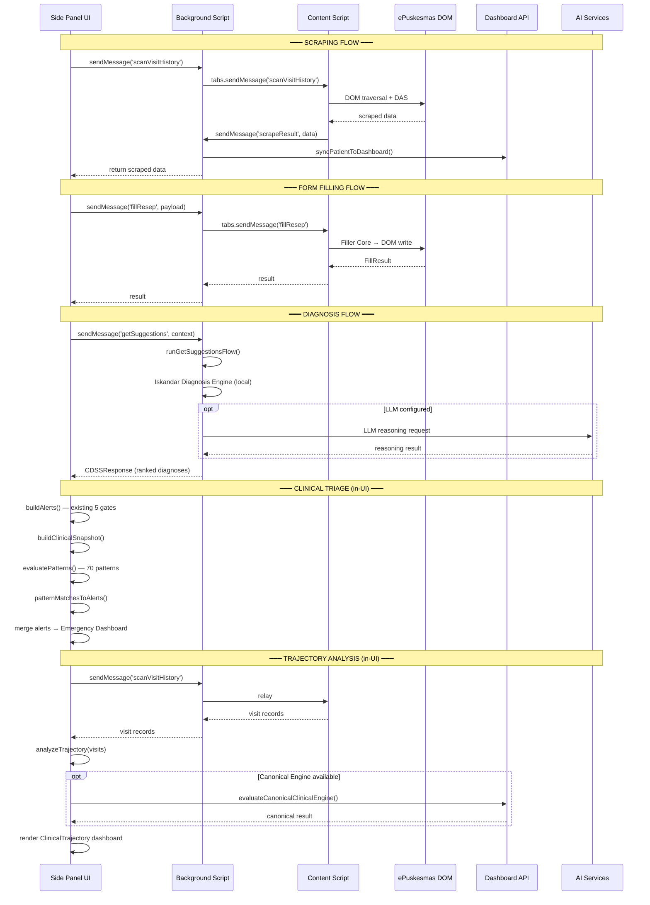
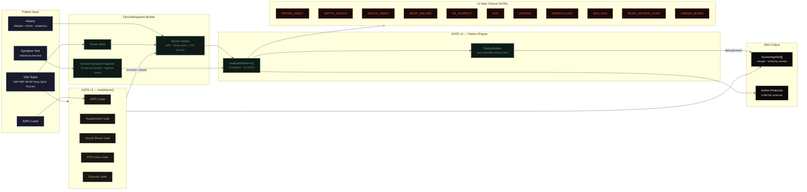
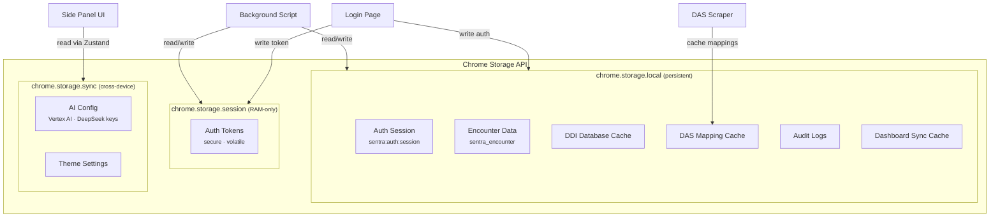
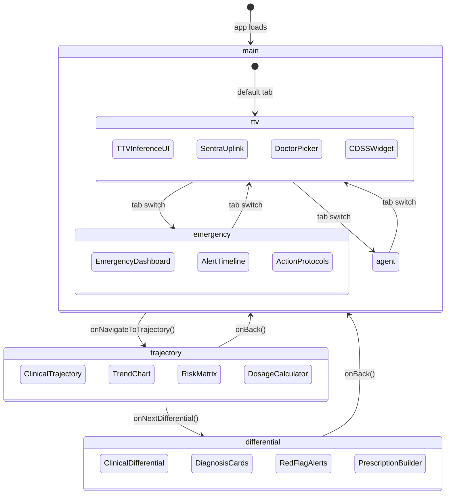

# Sentra Assist — System Architecture

> Last updated: 2026-04-17 · Author: Claudesy

---

## 1. High-Level Overview

```mermaid
graph TB
    subgraph EXT["🔷 Browser Extension (Chrome MV3)"]
        direction TB

        subgraph UI["UI Layer"]
            SP["Side Panel UI<br/><small>main.tsx · React 18</small>"]
            LP["Login Page<br/><small>login/main.tsx</small>"]
        end

        subgraph LOGIC["Logic Layer"]
            BG["Background Script<br/><small>background.ts · Service Worker</small>"]
            CS["Content Script<br/><small>content.ts · DOM Access</small>"]
        end

        subgraph ENGINES["Clinical Engines <small>(in lib/)</small>"]
            IDE["Iskandar Diagnosis Engine<br/><small>iskandar-diagnosis-engine/</small>"]
            ED["Emergency Detector<br/><small>emergency-detector/</small>"]
            PE["Pattern Engine v2<br/><small>70 patterns · 11 GATEs</small>"]
            TA["Trajectory Analyzer<br/><small>trajectory-analyzer.ts</small>"]
        end

        subgraph SCRAPER["Scraper System"]
            DAS["DAS<br/><small>Adaptive Scraper</small>"]
            FIL["Filler Core<br/><small>Form Writer</small>"]
            HND["Page Handlers<br/><small>anamnesa · diagnosa · resep</small>"]
        end

        subgraph DATA["Data Layer"]
            STR["Chrome Storage<br/><small>local · session · sync</small>"]
            DDI["DDI Database<br/><small>173K+ interactions</small>"]
            ICD["ICD-10 + RAG<br/><small>penyakit · stok obat</small>"]
        end
    end

    subgraph EXTERNAL["External Systems"]
        EMR["ePuskesmas EMR<br/><small>DOM · Web Page</small>"]
        API["Sentra Dashboard API<br/><small>crew.puskesmasbalowerti.com</small>"]
        AI["AI Services<br/><small>Vertex AI · DeepSeek</small>"]
    end

    %% UI → Background (message passing)
    SP -->|"sendMessage()"| BG
    LP -->|"AuthClient.login()"| BG

    %% Background → Content Script (relay)
    BG -->|"tabs.sendMessage()"| CS

    %% Content Script → Background (results)
    CS -->|"scrapeResult · visitHistory"| BG

    %% Content Script → DOM
    CS <-->|"scrape / fill"| EMR

    %% Content Script → Scraper subsystem
    CS --- DAS
    CS --- FIL
    CS --- HND

    %% Background → Engines
    BG -->|"getSuggestions"| IDE
    BG -->|"initializeCDSS"| ED

    %% Sidepanel → Engines (direct import)
    SP -->|"buildAlerts()"| ED
    SP -->|"evaluatePatterns()"| PE
    SP -->|"analyzeTrajectory()"| TA

    %% Engine relationships
    ED --- PE
    IDE -.->|"red flags"| ED

    %% Background → External
    BG <-->|"sync · transfer"| API
    BG -->|"LLM reasoning"| AI
    LP -->|"POST /auth/login"| API

    %% DAS → AI
    DAS -->|"Gemini Vision"| AI

    %% Data access
    BG --> STR
    BG --> DDI
    IDE --> ICD
    DAS --> STR

    %% Styling
    classDef uiNode fill:#1a2332,stroke:#6b9b8a,stroke-width:2px,color:#f4efe6
    classDef logicNode fill:#1a1a2e,stroke:#eb5939,stroke-width:2px,color:#f4efe6
    classDef engineNode fill:#0f1a16,stroke:#6b9b8a,stroke-width:1.5px,color:#6b9b8a
    classDef dataNode fill:#1a1a1a,stroke:#444,stroke-width:1px,color:#b7ab98
    classDef extNode fill:#0a0a0a,stroke:#eb5939,stroke-width:2px,color:#eb5939

    class SP,LP uiNode
    class BG,CS logicNode
    class IDE,ED,PE,TA engineNode
    class DAS,FIL,HND engineNode
    class STR,DDI,ICD dataNode
    class EMR,API,AI extNode
```



---

## 2. Message Flow Architecture



---

## 3. Clinical Engine Stack



---

## 4. Storage Architecture



---

## 5. Component Architecture — Side Panel Views



---

## 6. Key Design Principles

| Principle | Implementation |
|-----------|---------------|
| **Background as broker** | All cross-context communication routes through background.ts. Side Panel never talks to Content Script directly (except one `getPatientInfo` shortcut). |
| **Engines are local-first** | Diagnosis, trajectory, emergency detection all run in-browser with zero API dependency. AI services are optional enhancers. |
| **Pattern-as-data** | 70 clinical patterns are declarative `Criterion[]` arrays, not 70 separate functions. One engine evaluates all. |
| **Enricher pattern** | Existing detectors (AVPU, HTN, Glucose, Shock) are never modified — they populate derived values consumed by new patterns. |
| **Deduplication** | Pattern Engine skips patterns whose `supersededBy` matches existing buildAlerts() output IDs. |
| **Negation-aware NLP** | Indonesian symptom text parsing handles "tidak sesak", "sesak (-)", "menyangkal nyeri" to reduce false positives. |
| **Tiered activation** | Tier A (vitals only) + Tier B (vitals + keywords) active now. Tier C (needs new UI inputs) defined but gated. |
| **Storage separation** | Sensitive tokens in `session` (RAM), persistent data in `local`, cross-device config in `sync`. |

---

## 7. File Map

```
sentra-assist/
├── entrypoints/
│   ├── sidepanel/main.tsx        ← App shell, routing, state
│   ├── sidepanel/style.css       ← All styles (6000+ lines)
│   ├── login/main.tsx            ← Dashboard auth UI
│   ├── background.ts             ← Service worker (1900+ lines)
│   └── content.ts                ← DOM bridge (58KB)
├── components/clinical/
│   ├── TTVInferenceUI.tsx        ← Vital signs + triage (3300+ lines)
│   ├── ClinicalTrajectory.tsx    ← Trajectory dashboard (1368 lines)
│   └── ClinicalDifferential.tsx  ← Differential diagnosis (2597 lines)
├── lib/
│   ├── emergency-detector/       ← GATE v1 + v2 pattern engine
│   │   ├── pattern-engine.ts     ← Core evaluator
│   │   ├── clinical-patterns.ts  ← 70 pattern definitions
│   │   ├── clinical-snapshot.ts  ← Snapshot builder
│   │   ├── symptom-signals.ts    ← Indonesian keyword NLP
│   │   └── action-protocols.ts   ← 9 ABCDE protocols
│   ├── iskandar-diagnosis-engine/← Core diagnosis engine
│   │   └── trajectory-analyzer.ts← Vital trend analysis
│   ├── scraper/adaptive/         ← DAS (AI-powered scraper)
│   ├── api/                      ← Auth, bridge, polling
│   ├── clinical/                 ← Inference, thresholds, dosage
│   └── rag/                      ← ICD-10 search
└── data/                         ← DDI, field mappings, clinical data
```
